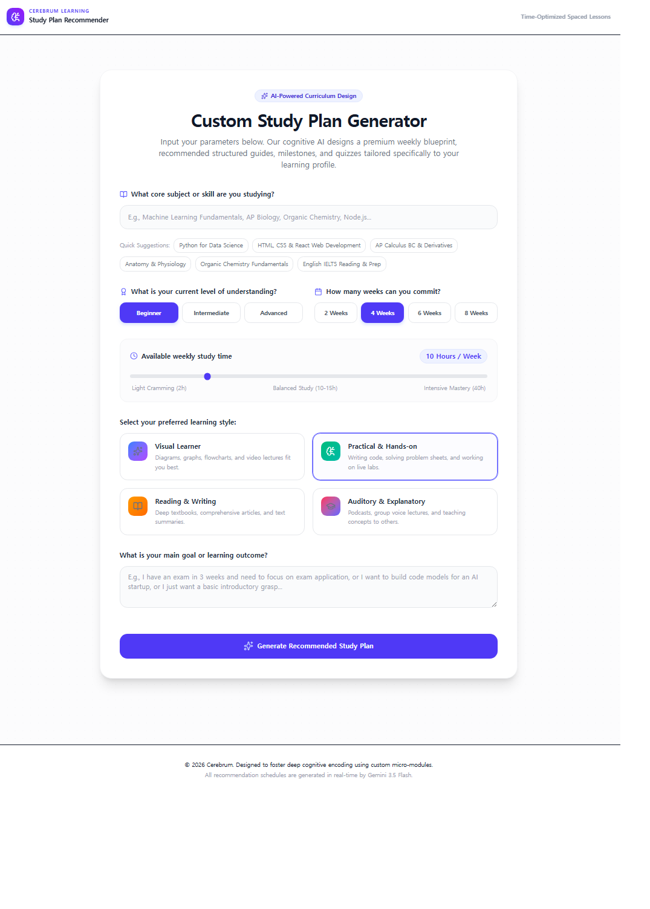
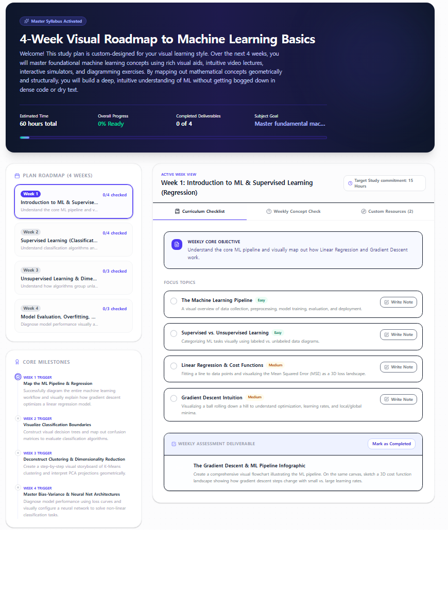
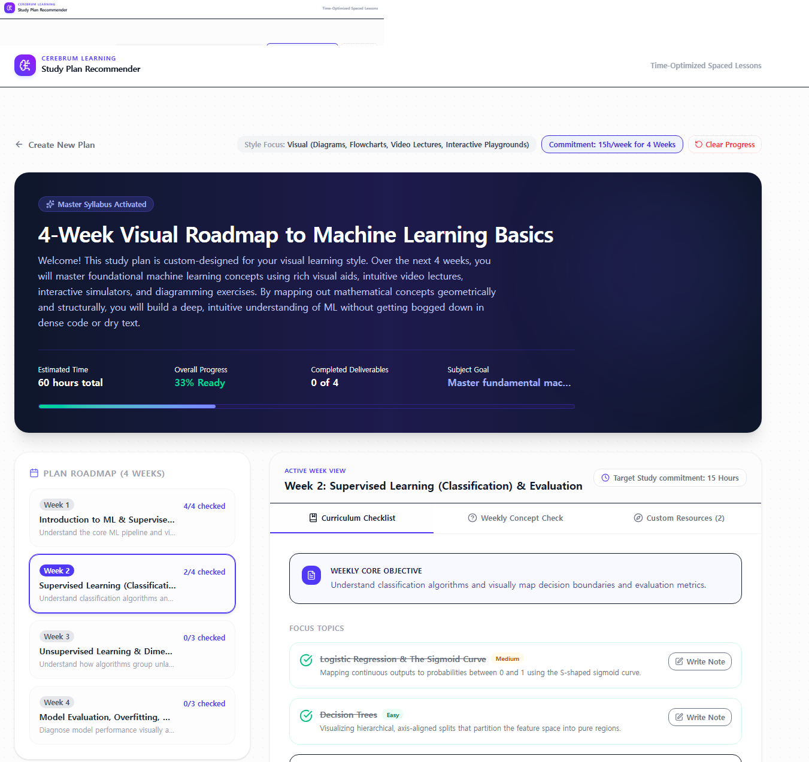
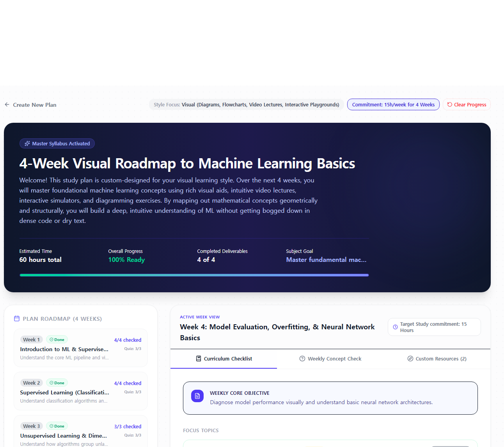

<div align="center">


# 🧠 AI Study Plan Recommender

**An AI-powered adaptive learning system that generates personalized study plans, tracks progress in real time, and continuously optimizes learning paths using Gemini API.**

Built while studying Google's **5-Day AI Agents Intensive Course**, incorporating concepts from Agent Workflows, MCP, Agent Skills, Security & Evaluation, and Spec-Driven Development.

</div>

---

## 🚀 Why this project?

Most study planners are static.

This project introduces a **dynamic learning loop powered by AI**, where:

* Learning plans are generated by AI
* User progress is continuously tracked
* Future recommendations adapt based on behavior

👉 Think of it as a lightweight AI Agent for personal learning.

---

# 🧠 AI Agent-Inspired Architecture

This project applies modern AI Agent concepts learned from Google's AI Agents Intensive.

Core Agent Components:

* Workflow
* Tools
* State
* Skills
* Feedback Loop
* Evaluation

---

## 🔄 Agent Workflow

```text
User Input
↓
generateStudyPlan()
↓
trackProgress()
↓
updateSchedule()
↓
evaluateCompletion()
↓
Gemini Feedback Loop
↓
Updated Learning Strategy
```

---

# 🔗 Agent Tools & Interoperability (Day 2)

This project was extended using Agent Tooling principles introduced in Day 2.

Rather than operating as an isolated LLM application, the system adopts concepts from tool-augmented agents and interoperable AI systems.

### Key Integrations

#### Model Context Protocol (MCP)

* Standardized protocol for connecting AI systems to external tools and services

#### GitHub MCP

* Repository-level interactions
* Project management workflows
* Future automation opportunities

#### Google Developer Knowledge MCP

* Access to structured developer documentation
* Reliable external knowledge source

#### Antigravity CLI

* Agent-oriented development environment
* Rapid iteration and experimentation

---

## 🔄 Tool-Augmented Architecture

```text
User Input
↓
Gemini Agent
↓
Tool Layer (MCP)
↓
External Services
↓
Updated Project State
```

### Impact

* AI is no longer isolated
* Tool-augmented reasoning becomes possible
* Enables interoperability between systems
* Reflects modern Agent ecosystem design

---

# 🤖 Agent Skills Layer (Day 3)

Inspired by Day 3 Agent Skills concepts.

Agent Skills encapsulate reusable reasoning patterns and workflows that can be applied repeatedly across tasks.

---

## Current Skills

### 📚 Study Planning Skill

* Analyze learning goals
* Generate personalized curriculum
* Create structured weekly roadmap

### 📈 Progress Tracking Skill

* Monitor completion status
* Identify learning gaps
* Track consistency

### 🎯 Adaptive Recommendation Skill

* Evaluate user performance
* Update future schedules
* Improve learning efficiency

---

## Skill-Based Workflow

```text
User Goal
↓
Study Planning Skill
↓
Progress Tracking Skill
↓
Adaptive Recommendation Skill
↓
Updated Learning Strategy
```

This modular approach follows modern Agent design patterns where reusable skills drive agent behavior.

---

# 🧩 Architecture Overview
📸 Project Structure


## System Layers

| Layer            | Responsibility                     |
| ---------------- | ---------------------------------- |
| UI Layer         | React-based user interaction       |
| AI Layer         | Gemini reasoning engine            |
| Tool Layer       | Agent tools and utilities          |
| State Layer      | Progress tracking and persistence  |
| Skill Layer      | Learning-related reasoning skills  |
| Evaluation Layer | Adaptive feedback and optimization |

---

## Conceptual Mapping

| Agent Concept | Project Mapping                   |
| ------------- | --------------------------------- |
| Agent         | Gemini-powered planner            |
| Tools         | Learning utilities                |
| Workflow      | Learning lifecycle                |
| State         | User progress memory              |
| Skills        | Planning and recommendation logic |
| Evaluation    | Continuous optimization           |

---

# 🔒 Security & Evaluation (Day 4)

Inspired by Day 4 concepts on Trustworthy AI Systems.

## Security Considerations

### Input Validation

* Validate user requests before AI processing

### Prompt Injection Awareness

* Prevent manipulation of AI instructions

### Sensitive Data Protection

* No storage of confidential user information

### Controlled Model Usage

* Restricted Gemini API interaction boundaries

### Modular Isolation

* Functional separation between system components

---

## Evaluation Strategy

The system is evaluated beyond simple correctness.

### Evaluation Dimensions

* Study plan quality
* Recommendation relevance
* Progress tracking consistency
* Adaptation effectiveness
* User experience

---

## Future Evaluation Enhancements

* LLM-as-a-Judge
* Behavioral Drift Detection
* Automated Evaluation Pipelines
* Multi-dimensional Quality Metrics

---

# 📐 Spec-Driven Development (Day 5)

Inspired by Google's Spec-Driven Production Development methodology.

Instead of treating code as the primary asset, specifications act as the source of truth.

---

## Design Principles

### Specification First

Requirements are defined before implementation.

### Reusable Behaviors

Agent actions are built around reusable workflows and skills.

### Continuous Improvement

Evaluation continuously informs future improvements.

### Human-Guided AI Development

AI assists implementation while humans define requirements and goals.

---

## Example Specification Flow

```text
Learning Goal
↓
Requirements Definition
↓
AI Plan Generation
↓
Progress Evaluation
↓
Adaptive Improvement
```

This approach improves maintainability, transparency, and future scalability.

---

# ✨ Features

* AI-generated personalized study plans
* Structured weekly curriculum generation
* Real-time progress tracking
* Adaptive learning recommendations
* Gemini-powered reasoning
* Persistent learning state
* Feedback-driven optimization loop
* Agent-inspired modular architecture

---

# 🛠 Tech Stack

### Frontend

* React
* TypeScript
* Vite
* Tailwind CSS

### Backend

* Node.js
* Express

### AI

* Gemini API (@google/genai)

### Environment

* dotenv

---

# 🔧 Core Agent Functions

These functions act as the project's Agent Tool Layer.

```text
generateStudyPlan()
trackProgress()
updateSchedule()
evaluateCompletion()
```

Together they simulate a lightweight AI Agent workflow.

---

# 📸 UI Preview

### Input → AI Generation



### Generated Study Plan



### Progress Tracking



### Completion State



---

# 💡 Design Philosophy

* Agent-oriented architecture
* Feedback-driven learning loop
* Tool-augmented AI systems
* Modular skill-based design
* Continuous evaluation mindset
* Spec-driven development principles

AI is not treated as a single API call.

Instead, it acts as part of an adaptive decision-making system.

---

# 📄 Project Context

The project includes a CONTEXT.md file defining:

* Design principles
* Development constraints
* Security considerations
* Evaluation guidelines
* Agent behavior expectations

---

# 🚀 Getting Started

## Prerequisites

Node.js

### Install Dependencies

```bash
npm install
```

### Environment Setup

```env
GEMINI_API_KEY=your_api_key_here
```

### Run Development Server

```bash
npm run dev
```

---

# 📌 Summary

This project demonstrates a modern AI-native application architecture inspired by Google's AI Agents Intensive course.

Concepts applied include:

* Agent Workflows
* MCP Interoperability
* Agent Skills
* Security & Evaluation
* Spec-Driven Development

The result is a lightweight AI-powered learning assistant capable of adapting to user progress and continuously improving recommendations.

---

# 🧠 Future Improvements

## Agent Capabilities

* Long-term memory
* Personalized learning history
* Multi-agent collaboration
* Autonomous skill selection

## Evaluation & Safety

* LLM-as-a-Judge
* Behavioral drift monitoring
* Automated evaluation pipelines

## Interoperability

* Additional MCP integrations
* External learning platform support
* Expanded tool ecosystem

## Production Readiness

* Agent Runtime deployment
* Monitoring dashboard
* Analytics pipeline
* Cloud-hosted agent architecture

---
